# Cardputer ADV GPS Info

Cardputer ADV GPS Info is a feature-rich GPS information tool for the M5Stack Cardputer ADV.
It reads GPS data via UART and displays location, speed, course, satellite visibility, sky plots, world map, 3D globe, and much more across 15 switchable screens.

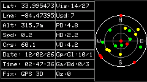
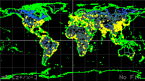
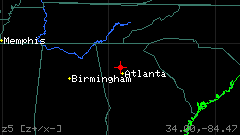
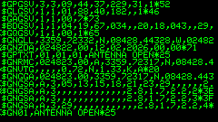
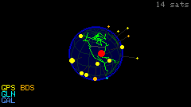
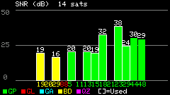
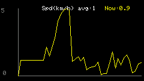
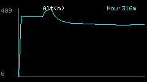
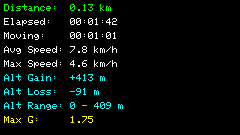
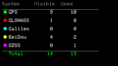
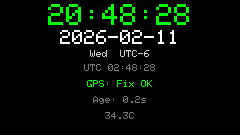
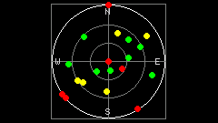

## Changelog

### 2.0.0
- Major rewrite with 15 switchable screens and off-screen frame buffer rendering
- Added screens: Sky View, Signal Bars, Fix Summary, Dashboard, Coordinates, Breadcrumb Track, Altitude Profile, Speed Graph, Trip Stats, Constellation, NMEA Monitor, GPS Clock, World Map, 3D Globe
- Added world coastline map data (Natural Earth) with zoom support
- Added 3D satellite globe visualization
- Added trip statistics (distance, max speed, ascent/descent, moving time)
- Added track recording buffer (breadcrumb trail)
- Added auto-slideshow mode for cycling through screens
- Added screenshot-over-serial (Enter key)
- Added PlatformIO project support (platformio.ini)

### 1.3.0
- Adapted for Cardputer ADV with Cap LoRa-1262 (shared SPI bus, UART2, default pins RX:15/TX:13)
- Added QZSS satellite support
- Added GGA sentence parsing (fix quality, geoid separation)
- Added GSA PDOP/VDOP parsing
- Replaced HDOP display with Fix quality + mode (e.g. "GPS 3D", "DGPS 2D", "RTK 3D")
- Status bar now shows 2D/3D fix mode and baudrate in kHz format
- Reorganized satellite stats column (Visb, Used, PDOP, HDOP, VDOP, GP/GL, GA/BD, QZ)
- Changed default UART to UART2, default baud to 115200 (ATGM336H)
- SPI3 (HSPI) used for SD card to avoid conflict with display SPI
- LoRa NSS held HIGH to prevent SPI bus contention

### 1.1.0
- Added configuration file support on microSD (cpGpsInfo.conf) to store GPS RX/TX pins and baudrate
- Added ability to modify GPS baudrate
- Fixed minor bugs
- Added GPS error state (on,off,err)

### 1.0.0
- First release

## Screens

The application features 15 screens, navigable with `[<]`/`[>]` keys or direct jump with `[0-9]`:

| # | Screen | Description |
|---|--------|-------------|
| 0 | Main | GPS data + sky plot + satellite stats (classic view) |
| 1 | Sky View | Enlarged satellite sky plot |
| 2 | Signal Bars | Satellite SNR bar chart |
| 3 | Fix Summary | Fix quality and DOP details |
| 4 | Dashboard | Large speed + heading + altitude |
| 5 | Coordinates | Large lat/lon in decimal and DMS formats |
| 6 | Breadcrumb | Track trail on local XY projection |
| 7 | Altitude Profile | Altitude vs time/distance graph |
| 8 | Speed Graph | Speed vs time graph |
| 9 | Trip Stats | Trip distance, time, averages, ascent/descent |
| 10 | Constellation | Per-system satellite breakdown |
| 11 | NMEA Monitor | Raw NMEA sentence scrollback |
| 12 | GPS Clock | Local clock display |
| 13 | World Map | World coastline map with GPS position and zoom |
| 14 | 3D Globe | 3D globe with satellite positions |

## Features

- Display GPS data: Latitude, Longitude, Altitude, Speed, Course, Date, Time
- Fix quality display: GPS/DGPS/RTK/Float RTK with 2D/3D mode
- DOP values: PDOP, HDOP, VDOP
- Track all satellites ever seen, currently visible, and those used in the fix
- Multi-constellation support: GPS, GLONASS, Galileo, BeiDou, QZSS
- Sky plot of satellites with color-coded status:
  - Green: used in fix
  - Yellow: visible
  - Red: not used
- Optionally show satellite ID and system on the plot
- SNR signal strength bar chart
- World coastline map with position marker and zoom levels
- 3D globe visualization with satellite positions
- Breadcrumb track recording and display
- Altitude profile and speed graphs
- Trip statistics with distance, speed, ascent/descent tracking
- IMU integration (BMI270): pitch, roll, G-force
- Auto-slideshow mode for hands-free screen cycling
- Screenshot capture over USB serial
- Off-screen frame buffer for flicker-free rendering

- Keyboard controls:
  - `[s]` Start/Stop GPS serial
  - `[c]` Configuration menu
  - `[h]` Help menu
  - `[i]` Info menu
  - `[<]` Previous screen
  - `[>]` Next screen
  - `[.]` Toggle auto-slideshow (5s interval)
  - `[0-9]` Jump to screen 0-9
  - `[p]` Show/hide satellite ID on sky plot
  - `[o]` Show/hide system on sky plot
  - `[l]` Print satellite list to USB serial
  - `[n]` Print NMEA sentences to USB serial
  - `[z/x]` Zoom in/out on map screen
  - `[Enter]` Send screenshot over USB serial

## Utilities

The `utils/` folder contains helper scripts for development:

- **`convert_geodata.py`** — Converts [Natural Earth](https://www.naturalearthdata.com/) GeoJSON files (10m/50m resolution) into a compact PROGMEM C header (`src/map_data.h`) for the ESP32. Applies Douglas-Peucker simplification, auto-tunes per-layer tolerance to fit a 2.4 MB flash budget, and adds bounding-box headers for fast viewport culling at runtime. Requires GeoJSON source files in a `geodata/` directory.
  ```
  python utils/convert_geodata.py
  ```

- **`serial_screenshot.py`** — Captures screenshots sent over USB serial when the Enter key is pressed on the Cardputer. Listens for RGB565 pixel data and saves as BMP files. Requires the `pyserial` package.
  ```
  python utils/serial_screenshot.py [COM_PORT]
  ```

## Hardware

- M5Stack Cardputer ADV
- Cap LoRa-1262 module (provides ATGM336H GPS via UART2, shared SPI bus for SD + LoRa)
- Default pins: RX 15, TX 13 (EXT header on Cap LoRa-1262)
- Default baud: 115200

## Building

### PlatformIO (recommended)

A `platformio.ini` is included for building with PlatformIO. The v2.0.0 source is in `src/`.

```
pio run -e m5cardputer-adv
pio run -e m5cardputer-adv -t upload
```

### Arduino IDE

Open `Cardputer_GPS_Info.ino` (v1.3.0) directly in Arduino IDE. Requires the M5Cardputer and TinyGPSPlus libraries.

## NMEA sentences to USB serial `[n]`

If you want to share the Cardputer GPS data via serial to another software, now you can!
Press `[n]`, with the Cardputer connected via USB, open your NMEA software, select the port, enjoy!


## Print satellite list to USB serial `[l]`


